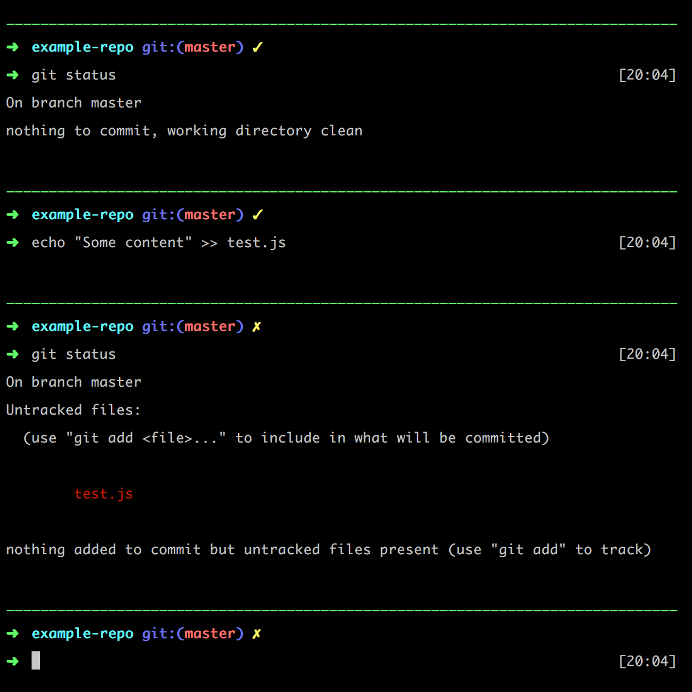

# Custom Theme for Oh My Zsh

## Installation

Copy the theme file from this repository to your Oh My Zsh themes directory.

By default, it's here: `~/.oh-my-zsh/themes`

If you wish, you can change the ***custom*** part of the file name. For example: `mytheme.zsh-theme`

Open your `.zshrc` file in a text editor.

By default, it's here: `~/.zshrc`

Locate the `ZSH_THEME` line.

Add the name of the theme. For example: `ZSH_THEME="mytheme"`

## Screenshot

